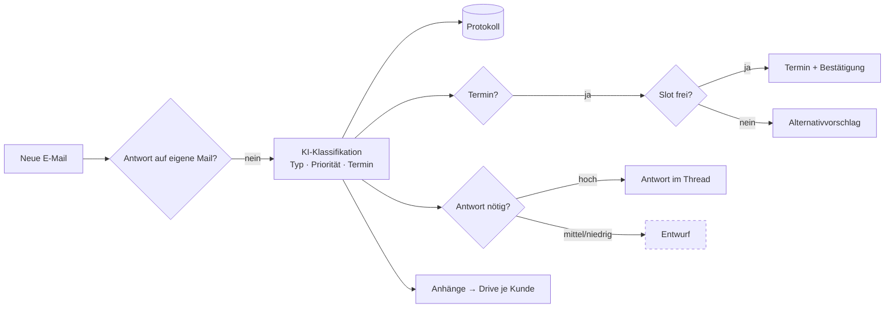
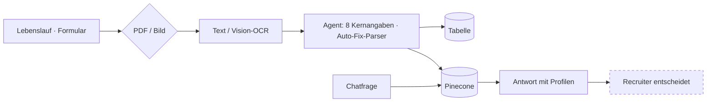
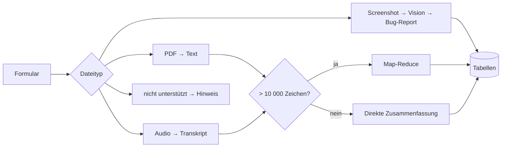
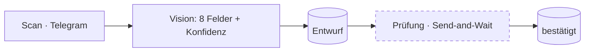

# Architektur / Architecture

## 03 · E-Mail-Assistent

```mermaid
flowchart LR
  M[Neue E-Mail] --> S{Antwort auf eigene Mail?} -- nein --> AI[KI-Klassifikation<br/>Typ · Priorität · Termin]
  AI --> LOG[(Protokoll)]
  AI --> CAL{Termin?} -- ja --> FREE{Slot frei?}
  FREE -- ja --> EV[Termin + Bestätigung]
  FREE -- nein --> ALT[Alternativvorschlag]
  AI --> R{Antwort nötig?} -- hoch --> SEND[Antwort im Thread]
  R -- mittel/niedrig --> DRAFT[Entwurf]:::human
  AI --> ATT[Anhänge → Drive je Kunde]
  classDef human stroke-dasharray: 5 5
```

## 05 · Recruiting

```mermaid
flowchart LR
  CV[Lebenslauf · Formular] --> T{PDF / Bild}
  T --> X[Text / Vision-OCR] --> J[Agent: 8 Kernangaben · Auto-Fix-Parser]
  J --> SH[(Tabelle)] & PC[(Pinecone)]
  Q[Chatfrage] --> PC --> A[Antwort mit Profilen] --> H[Recruiter entscheidet]:::human
  classDef human stroke-dasharray: 5 5
```

## 08 · Structured Output

```mermaid
flowchart LR
  F[Formular] --> SW{Dateityp}
  SW --> V[Screenshot → Vision → Bug-Report]
  SW --> P[PDF → Text]
  SW --> AU[Audio → Transkript]
  SW --> NO[nicht unterstützt → Hinweis]
  P & AU --> L{> 10 000 Zeichen?}
  L -- ja --> MR[Map-Reduce]
  L -- nein --> D[Direkte Zusammenfassung]
  V & MR & D --> SH[(Tabellen)]
```

## 14a · Ausweis-OCR

```mermaid
flowchart LR
  S[Scan · Telegram] --> O[Vision: 8 Felder + Konfidenz] --> DR[(Entwurf)] --> H[Prüfung · Send-and-Wait]:::human --> OK[(bestätigt)]
  classDef human stroke-dasharray: 5 5
```
